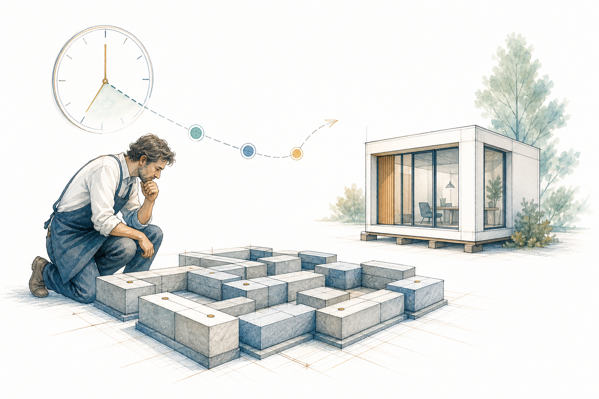

<!-- _class: lead title-slide -->

# Secretarius change d’architecture
## Pourquoi cette refonte était nécessaire

**Objectif**: un assistant plus fiable, confidentiel et durable
**Contexte**: point d’avancement et explication du retard
**Date**: Juin 2026

---

# Les questions auxquelles nous allons répondre

1. **Pourquoi l’architecture initiale a-t-elle atteint ses limites ?**
2. **Pourquoi cette limite affecte-t-elle particulièrement les modèles légers ?**
3. **Quelle architecture avons-nous retenue ?**
4. **Pourquoi cette refonte a-t-elle un impact sur le calendrier ?**
5. **Quels bénéfices concrets apporte-t-elle au produit livré ?**

---

<!-- _class: lead title-slide -->

# Agenda

### Partie 1: Le constat
Comprendre la limite rencontrée et ses conséquences

### Partie 2: La solution retenue
Présenter une architecture légère, spécialisée et contrôlable

### Partie 3: Les engagements
Expliquer le retard, les bénéfices et la suite du projet

---

<!-- _header: "" -->
<!-- _class: lead part-constat -->

# Partie 1: Le constat

**L’architecture initiale fonctionnait, mais ne pouvait pas évoluer durablement**

---

<!-- header: "**Le constat** > La solution retenue > Les engagements" -->

# Ce qui était prévu

Secretarius devait réunir dans un même assistant :

- Une conversation simple en langage naturel
- Une mémoire documentaire personnelle
- La recherche dans les courriels et les documents
- La consultation sécurisée de sources externes
- L’exécution de tâches selon les règles de l’utilisateur

> L’objectif reste inchangé : un assistant personnel utile, sobre et sous contrôle

---

# Le point de blocage

L’assistant principal devait connaître en permanence la description de **tous les outils disponibles**

- Recherche documentaire
- Messagerie et agenda
- Navigation sécurisée
- Base de connaissances
- Outils de contrôle et de routage

Chaque nouvel outil augmentait la quantité d’instructions à relire avant même de répondre

---

# Un contexte devenu trop lourd

≈ 11 700

**unités de contexte** chargées au démarrage de chaque échange

Cette charge est présente avant même d’ajouter :

- La demande de l’utilisateur
- Les documents utiles
- L’historique de la conversation

| Conséquence | Effet observé |
|---|---|
| Démarrage plus lent | Temps d’attente accru |
| Capacité utile réduite | Moins de place pour le dossier réel |
| Routage fragile | Mauvais outil ou mauvaise opération |
| Modèle léger saturé | Réponses instables ou impossibles |

---

# Pourquoi un modèle léger ne suffit plus

Un modèle léger peut être rapide, économique et exécuté localement

Mais il ne peut pas simultanément :

- Relire un volumineux catalogue d’outils
- Comprendre la demande métier
- Choisir le bon outil et les bons paramètres
- Contrôler le résultat et répondre clairement

> Le problème ne venait pas d’un manque de puissance brute, mais d’une mauvaise répartition du travail

---

# Continuer ainsi aurait créé une dette durable

| Option | Avantage immédiat | Risque à terme |
|---|---|---|
| Ajouter un modèle plus puissant | Masque le problème | Coût, dépendance et confidentialité |
| Réduire quelques instructions | Gain rapide mais limité | Saturation au prochain outil |
| Repenser l’architecture | Effort de refonte | Base saine et extensible |

**Décision retenue**: corriger la structure plutôt que compenser ses limites

---

<!-- _header: "" -->
<!-- _class: lead part-solution -->

# Partie 2: La solution retenue

**Un chef d’orchestre léger entouré de spécialistes**

---

<!-- header: "Le constat > **La solution retenue** > Les engagements" -->

# Le principe directeur

L’assistant principal devient un **orchestrateur léger**

Son rôle se limite à :

- Comprendre la demande
- Identifier l’action attendue
- Confier le travail au bon spécialiste
- Restituer le résultat à l’utilisateur

Avant
<strong>≈ 11 700</strong>
unités de contexte

Cible
<strong>≈ 1 000</strong>
unités de contexte

---

# Une équipe d’agents spécialisés

Chaque agent dispose uniquement des capacités nécessaires à sa mission

---

# Une responsabilité claire par agent

| Composant | Mission | Accès |
|---|---|---|
| **Tiron** | Dialogue et orchestration | Minimum nécessaire |
| **Agent wiki** | Mémoire et recherche documentaire | Base de connaissances |
| **Scout** | Lecture sécurisée du web | Sources externes filtrées |
| **Agent Google** | Courriels, agenda et Drive | Services Google autorisés |

Cette séparation applique un principe simple :

> Un composant ne reçoit que les outils et les données dont il a réellement besoin

---

# Les outils sortent du contexte permanent

Dans l’ancienne architecture, les outils MCP devaient être décrits au modèle principal

Dans la nouvelle architecture :

- Les capacités sont placées dans l’environnement du spécialiste
- Les instructions détaillées sont chargées seulement au moment utile
- L’orchestrateur ne porte plus le catalogue complet
- Chaque environnement peut être testé et mis à jour séparément

**Résultat**: moins de contexte, moins de dépendances et moins de points de panne

---

# Un routage déterministe

Pour les opérations importantes, Secretarius ne demande plus au modèle de deviner librement quoi faire

  
<strong>Commande ou intention</strong> Exemple : rechercher un mail

  
→

  
<strong>Route définie</strong> Opération précise

  
→

  
<strong>Agent spécialisé</strong> Outil isolé

  
→

  
<strong>Résultat fidèle</strong> Sans succès inventé

> L’intelligence reste utile pour comprendre et dialoguer, mais les opérations critiques suivent un chemin contrôlé

---

# Ce que la nouvelle architecture améliore

| Dimension | Amélioration |
|---|---|
| **Fiabilité** | Une opération correspond à un chemin connu |
| **Confidentialité** | L’orchestrateur peut fonctionner avec un modèle local |
| **Sécurité** | Chaque agent possède des accès limités |
| **Performance** | Le contexte initial est fortement réduit |
| **Maintenance** | Les spécialistes évoluent indépendamment |
| **Évolutivité** | Une nouvelle capacité n’alourdit plus tout le système |

---

<!-- _header: "" -->
<!-- _class: lead part-engagements -->

# Partie 3: Les engagements

**Le retard finance une base plus fiable, pas une simple modification cosmétique**

---

<!-- header: "Le constat > La solution retenue > **Les engagements**" -->

# Pourquoi cette refonte prend du temps

La modification touche les fondations techniques :

- Séparation des responsabilités
- Création des agents spécialisés
- Isolation de leurs outils
- Nouveau mécanisme de routage
- Vérification des échanges entre agents
- Reprise des fonctions déjà développées

> Une partie du travail existant doit être réintégrée et retestée dans la nouvelle structure

---

# L’impact sur le calendrier

### 1. Limite identifiée

Les tests avec un modèle léger révèlent que le contexte des outils est incompatible avec l’objectif de sobriété

### 2. Architecture sécurisée

Les preuves techniques valident l’orchestrateur léger, la délégation et le routage déterministe

### 3. Recouvrement fonctionnel

Les fonctions existantes sont réintégrées, testées et préparées pour la livraison

Le retard provient principalement de cette **reconstruction contrôlée**, nécessaire pour éviter une livraison fragile

---

# Ce que le client y gagne

- **Un assistant plus stable** dans les tâches quotidiennes
- **Des réponses plus rapides** grâce à un contexte réduit
- **Une meilleure confidentialité** avec la possibilité d’orchestrer localement
- **Des actions plus sûres** grâce aux routes et validations explicites
- **Une solution durable** pouvant accueillir de nouvelles fonctions métier

Pour un usage immobilier, cela prépare notamment une gestion plus fiable des dossiers, documents, courriels et recherches

---

# Nos engagements pour la suite

1. **Prioriser le recouvrement fonctionnel** avant toute nouvelle fonctionnalité
2. **Tester chaque commande de bout en bout** dans les conditions réelles d’utilisation
3. **Conserver une validation humaine** pour les actions externes sensibles
4. **Documenter clairement l’état d’avancement** et les limites restantes
5. **Livrer sur une base stabilisée** plutôt que masquer une fragilité connue

---

# À retenir

La première architecture concentrait trop de responsabilités dans un seul modèle

La nouvelle architecture :

- Allège l’orchestrateur d’environ **11 700 à 1 000 unités de contexte**
- Confie chaque mission à un agent spécialisé
- Remplace les décisions fragiles par des routes contrôlées
- Renforce la confidentialité, la sécurité et la maintenabilité

> Le calendrier s’allonge à court terme pour éviter des retards et incidents répétés après la livraison

